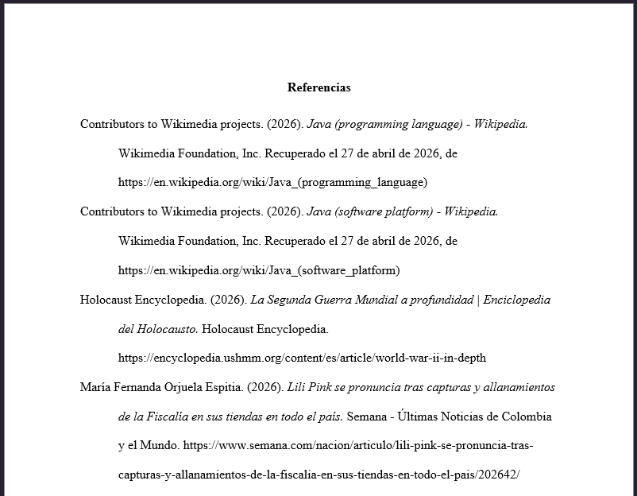

# 📚 CitaElSitio - Generador Inteligente de Citas APA (7ma Edición)

[](https://reactjs.org/)
[](https://tailwindcss.com/)
[](https://vitejs.dev/)
[]()

> **Una aplicación web *Mobile-First* diseñada para automatizar la extracción de metadatos web y formatear referencias bibliográficas bajo los estrictos estándares de APA 7ma Edición.**

---

## 🎯 Descripción del Problema

El proceso de formatear referencias bibliográficas es una de las tareas más tediosas y propensas a errores para estudiantes y académicos. Las herramientas actuales suelen tener interfaces anticuadas, requieren cuentas de pago o no aplican correctamente las sutilezas de la norma APA (como la sangría francesa o el uso condicional de fechas de recuperación).

**CitaElSitio** resuelve este problema ofreciendo una experiencia sin fricciones: el usuario ingresa una URL, el sistema extrae automáticamente la información del portal y el motor lógico ensambla la cita perfecta. Al finalizar, permite exportar toda la lista de referencias directamente a `.docx` o `.pdf` lista para entregar.

## 🛠️ Stack Tecnológico

El proyecto fue desarrollado como una SPA (Single Page Application) sin backend (Serverless), priorizando la velocidad y el diseño responsivo:

* **Frontend:** `React.js` (Hooks, Functional Components).
* **Estilos y UI:** `Tailwind CSS` (Arquitectura Bento Grid y diseño Mobile-First).
* **Extracción de Datos:** Integración con la API REST de `Microlink.io` para *web scraping* evadiendo restricciones CORS.
* **Persistencia:** API de `LocalStorage` (Cero costos de base de datos).
* **Generación de Archivos:** `jsPDF` (para documentos PDF) y `docx` (para exportación nativa a MS Word con estilos APA).

## 🧠 Hito Técnico Principal

El mayor desafío técnico fue construir el **Motor Lógico APA (`apaEngine.js`)** y acoplarlo a la exportación nativa de Word. 

No se trataba solo de concatenar textos. Se implementó una lógica de segmentación donde el motor evalúa el tipo de fuente (Web, Artículo, Video) y devuelve un arreglo de objetos indicando qué palabras exactas requieren formato *itálico*. Al exportar a Word mediante la librería `docx`, el código inyecta matemáticamente la sangría francesa (Hanging Indent a 0.5 pulgadas) y el interlineado doble, entregando un documento que cumple al 100% con la norma sin requerir edición manual posterior.

> 📸 *[ESPACIO PARA CAPTURA DE PANTALLA: Inserta aquí una imagen de CitaElSitio funcionando en escritorio (Bento Grid) y otra al lado mostrando cómo se apila perfectamente en versión móvil]*

## 💼 Perfil Híbrido: Código con Visión de Negocio

Mi background previo en **[TU CARRERA ANTERIOR, ej: Administración / RRHH / Gestión de Proyectos]** combinado con mi actual formación como Tecnóloga en Análisis y Desarrollo de Software me ha dado una visión sumamente pragmática del desarrollo: **el código debe resolver problemas reales, ser eficiente y no generar gastos innecesarios.**

Este proyecto refleja esa mentalidad. En lugar de construir un backend costoso para hacer *scraping*, integré una API gratuita de alto rendimiento. En lugar de forzar a los usuarios a registrarse, utilicé almacenamiento local para retener su historial de forma segura. Esta capacidad para diseñar soluciones arquitectónicas que balancean la viabilidad técnica con la excelente experiencia de usuario (UX) es el valor principal que aporto a cualquier equipo de desarrollo.

## 📊 Funcionalidades Clave

* **Autocompletado Inteligente:** Extracción asíncrona de título, autor y año desde cualquier URL.
* **Paginación Integrada:** Manejo de estado en React para navegar por bibliografías extensas sin romper la interfaz.
* **Edición en Vivo:** Capacidad de modificar citas autogeneradas y actualizar el historial en tiempo real.
* **Exportación Profesional:** Descarga de las Referencias en formato Word nativo (con sangrías e itálicas correctas) o PDF.
* **Modo Oscuro:** Soporte completo de temas visuales mediante Tailwind CSS.



## Instalación y Uso

Si deseas correr este proyecto en tu entorno local, sigue estos pasos:

1. Clona el repositorio:
   ```bash
   git clone [https://github.com/tu-usuario/citaelsitio.git](https://github.com/tu-usuario/citaelsitio.git)